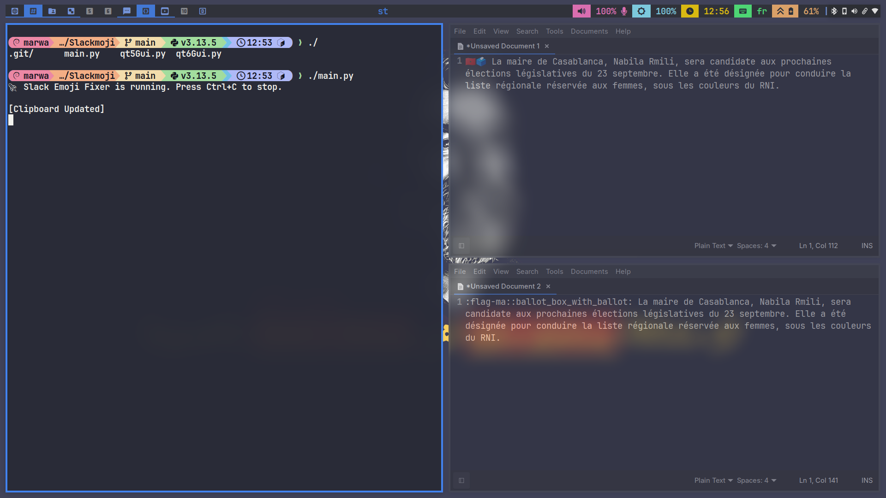

# 😄 Slackmoji

**Fix Slack emoji shortcodes the moment you copy them.**

Slack copies text like `:smile:` or `:tada:` instead of the actual emoji character — which looks broken the moment you paste it into X, Instagram, LinkedIn, or anywhere else. Slackmoji watches your clipboard in the background and silently converts those shortcodes into real emoji, so what you paste always looks right.

<div align="center">


<sub>Demo</sub>
<br>

</div>

---

## ✨ Features

- 🖇️ **Clipboard monitoring** — runs quietly in the background and checks your clipboard once a second
- 🔁 **Automatic conversion** — replaces `:emoji_code:` text with the actual Unicode emoji
- 🧩 **Custom Slack emoji support** — maps Slack-specific/custom codes in addition to standard ones
- 🖥️ **Three ways to run it** — a lightweight CLI, a PyQt5 tray app, or a PyQt6 tray app
- 🐧 **Wayland-friendly** — automatically switches clipboard backend when running under Wayland

---

## 📦 How it works

1. You copy some text in Slack that contains emoji shortcodes (e.g. `Great job team :tada: :rocket:`).
2. Slackmoji detects the change in your clipboard.
3. It replaces every recognized shortcode with the matching emoji.
4. It copies the fixed text back to your clipboard.
5. You paste — and it just works: `Great job team 🎉 🚀`

---

## 🚀 Getting Started

### Prerequisites

- Python 3
- [`pyperclip`](https://pypi.org/project/pyperclip/)
- `PyQt5` or `PyQt6` (only required if you want the tray icon GUI)

### Installation

```bash
git clone https://github.com/marwatoo/Slackmoji.git
cd Slackmoji
pip install pyperclip
```

If you want the system tray app, also install the Qt bindings you prefer:

```bash
pip install PyQt5   # for qt5Gui.py
# or
pip install PyQt6   # for qt6Gui.py
```

### Usage

**Command line (no GUI, prints status to your terminal):**

```bash
python3 main.py
```

**System tray app (PyQt5):**

```bash
python3 qt5Gui.py
```

**System tray app (PyQt6):**

```bash
python3 qt6Gui.py
```

Once running, leave it in the background — every time you copy text containing emoji shortcodes, Slackmoji will fix it automatically. Press `Ctrl+C` to stop the CLI version, or right-click the tray icon and choose **Exit** to stop a GUI version.

> **Wayland users:** Slackmoji automatically switches `pyperclip` to use `wl-clipboard` when it detects a Wayland session. Make sure `wl-clipboard` is installed on your system.

---

## 🗂️ Project Structure

| File | Description |
|---|---|
| `main.py` | CLI entry point — monitors the clipboard and converts emoji codes |
| `qt5Gui.py` | System tray application using PyQt5 |
| `qt6Gui.py` | System tray application using PyQt6 |
| `custom_emojis.py` | Custom emoji definitions and the emoji-matching pattern |
| `util_emojis.py` | Core logic for replacing emoji shortcodes with emoji characters |
| `smile.png` | Tray icon used by the GUI apps |

---

## 🙏 Acknowledgments

This code was generated with the help of ChatGPT.

---

## 🤝 Contributing

Issues and pull requests are welcome! If you run into a shortcode that isn't converting correctly, feel free to open an issue.

---

## 📄 License

Licensed under the [MIT License](LICENSE).
